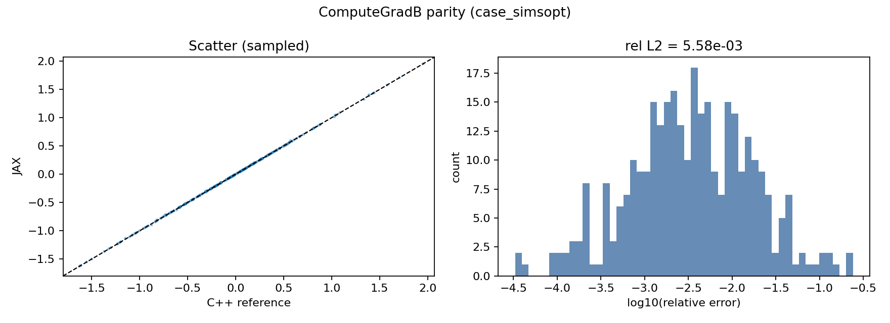
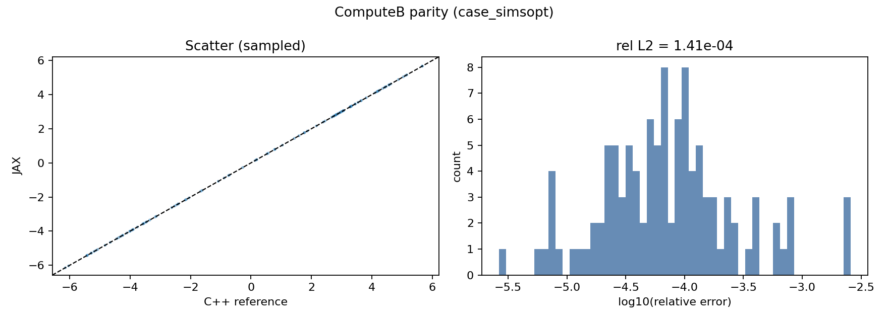

ComputeGradB and Autodiff
=========================

This section documents the ``ComputeGradB`` pathway in ``virtual_casing_jax`` and
how it is used for JAX-based automatic differentiation. The goal is to make the
gradient of the **external** magnetic field on the surface available with
high-order singular quadrature and end-to-end differentiability.

Overview
--------

``ComputeGradB`` returns the on-surface gradient of the external field

.. math::

   \nabla \mathbf{B}_{\mathrm{ext}}(\mathbf{r})

on the surface ``Gamma`` where the total field ``B`` is prescribed. This is the
operator needed in single-stage optimization when objectives depend on
``B`` and its spatial derivatives. Typical examples include:

- derivatives of ``|B|`` or ``B^2`` on the surface
- sensitivities of ``B \cdot n`` or normal field error
- penalty terms involving ``\nabla B`` for smoothness or stability proxies

Equations (from the BIEST formulation)
-------------------------------------

Let ``\sigma = \mathbf{B}\cdot\mathbf{n}`` and ``\mathbf{K} = \mathbf{n}\times\mathbf{B}``.
For targets on ``Gamma`` the virtual casing formula gives [MCO2019]_:

.. math::

   \mathbf{B}_{\mathrm{ext}}(\mathbf{r})
   = \frac{1}{2}\mathbf{B}(\mathbf{r})
   + \nabla G[\sigma](\mathbf{r})
   + \nabla \times G[\mathbf{K}](\mathbf{r}),

where ``G`` is the Laplace single-layer potential:

.. math::

   G[\sigma](\mathbf{r}) = \frac{1}{4\pi}\int_{\Gamma}
   \frac{\sigma(\mathbf{r}')}{\lVert \mathbf{r} - \mathbf{r}' \rVert}
   \, d a(\mathbf{r}').

Taking a spatial derivative yields the on-surface field gradient:

.. math::

   (\nabla \mathbf{B}_{\mathrm{ext}})_{k i}
   = \partial_i B_{\mathrm{ext},k}
   = \varepsilon_{k \ell m}\,\partial_i\partial_\ell G[K_m]
   + \partial_i\partial_k G[\sigma].

Here ``\partial_i\partial_j G`` is the hypersingular Laplace kernel,
implemented in BIEST and ported to JAX as ``LaplaceFxd2U``. The explicit
second derivative kernel used in this code base is:

.. math::

   \partial_i\partial_j G(r) = \frac{1}{4\pi}\left(
   -\delta_{ij}\lVert r \rVert^{-3} + 3 r_i r_j \lVert r \rVert^{-5}\right),

matching the formulation in [MCO2019]_.

Implementation Map
------------------

The high-level call ``VirtualCasingJAX.compute_external_gradB`` implements:

1. **Complete and resample** the surface field.
   The input ``B0`` is completed over the full toroidal period and resampled to
   the quadrature grid.
2. **Form surface densities**:

   .. math::

      \mathbf{K} = \mathbf{n} \times \mathbf{B}, \qquad
      \sigma = \mathbf{B} \cdot \mathbf{n}.

3. **Evaluate hypersingular operators**:

   - ``laplace_fxd2_u_eval_vec_singular`` computes
     ``\partial_i\partial_\ell G[K_m]`` on the target grid.
   - ``laplace_fxd2_u_eval_singular`` computes
     ``\partial_i\partial_k G[\sigma]`` on the target grid.

4. **Assemble the curl** for the vector term:

   .. math::

      (\nabla \times G[\mathbf{K}])_k
      = \partial_{k_1} G[K_{k_2}] - \partial_{k_2} G[K_{k_1}],

   with cyclic indices ``(k, k_1, k_2)``.

The implementation mirrors the C++ ``ComputeGradB`` path, including the
**same quadrature order**, **patch selection**, and **singular corrections**.

Singular Quadrature (POU + Polar + Hedgehog)
--------------------------------------------

The on-surface operators are hypersingular. The JAX port uses the same
three-part strategy as BIEST [MCO2019]_:

- **Partition of Unity (POU)** to localize the singular region.
- **Polar interpolation** for near-singular contributions.
- **Hedgehog quadrature** to evaluate the hypersingular terms at the target.

These steps are implemented in ``laplace_fxd2_u_eval_singular`` and
``laplace_dx_u_eval_singular``. The combination produces a stable
``O(h^{p})``-accurate on-surface limit that matches the reference
implementation.

Autodiff Strategy
-----------------

Naive autodiff through the singular quadrature stack is both slow and
numerically fragile. Instead, ``virtual_casing_jax`` uses a **custom JVP**
that contracts the analytically defined surface gradient with a target
perturbation:

.. math::

   \delta \mathbf{B}_{\mathrm{ext}} \approx
   (\nabla \mathbf{B}_{\mathrm{ext}}) : \delta \mathbf{X}.

This is implemented in
``VirtualCasingJAX.compute_external_B_autodiff`` using ``jax.custom_jvp``.
The JVP calls ``compute_external_gradB`` and applies:

.. math::

   \delta B_k = \sum_i (\nabla B)_{k i}\, \delta X_i.

This provides **exact on-surface derivatives** consistent with the C++
``ComputeGradB`` operator, and it avoids differentiating through the
singular correction machinery.

Internal and Off-Surface GradB
------------------------------

The internal gradient uses the same on-surface hypersingular operators,
but with the **sign flipped**:

.. math::

   \nabla \mathbf{B}_{\mathrm{int}} = -\nabla \mathbf{B}_{\mathrm{ext}}.

This matches the reference implementation in ``virtual-casing`` and is
validated in parity tests. Note that the on-surface hypersingular evaluation
uses the same quadrature orientation for internal and external limits, which
is consistent with the C++ behavior.

For **off-surface targets**, the jump term is absent and the gradient is
evaluated using direct quadrature (no singular correction):

.. math::

   (\nabla \mathbf{B}_{\mathrm{ext}})_{k i}
   = \varepsilon_{k \ell m}\,\partial_i\partial_\ell G[K_m]
   + \partial_i\partial_k G[\sigma],

with ``\mathbf{K} = \mathbf{n}\times\mathbf{B}`` and
``\sigma = \mathbf{B}\cdot\mathbf{n}`` defined on the source surface.
The JAX implementation optionally upsamples the source grid using the
same ``LaplaceDxU`` self-test used by the adaptive off-surface field
evaluation. The current parity path mirrors the reference C++ off-surface
GradB implementation, which uses the base resampled grid (no adaptive
refinement).

Parity and Validation
---------------------

Parity means the JAX and C++ implementations agree for **identical inputs**
to within the specified tolerances. We use the relative L2 error:

.. math::

   \mathrm{rel\_err} =
   \frac{\lVert u_{\mathrm{jax}} - u_{\mathrm{ref}} \rVert_2}
        {\lVert u_{\mathrm{ref}} \rVert_2 + \epsilon}.

The parity suite includes:

- ``tests/test_virtual_casing_gradb_parity.py`` (ComputeGradB parity)
- ``tests/test_autodiff_gradb_parity.py`` (autodiff JVP parity)
- ``tests/test_virtual_casing_gradbint_parity.py`` (internal GradB parity)
- ``tests/test_virtual_casing_offsurf_parity.py`` (off-surface B/GradB parity)

The following figures show parity on the SIMSOPT VMEC case.

   ComputeGradB parity: JAX vs C++ scatter (left) and log10 relative error
   distribution (right) for the SIMSOPT VMEC case.

   ComputeB parity: JAX vs C++ scatter (left) and log10 relative error
   distribution (right) for the SIMSOPT VMEC case.

Where GradB Is Used in Optimization
-----------------------------------

``ComputeGradB`` enables gradients of common physics objectives. Examples:

- **Field magnitude penalties**:

  .. math::

     f = \int_\Gamma |B|^2\, d a, \qquad
     \nabla f \propto \int_\Gamma 2\,\mathbf{B}\cdot (\nabla \mathbf{B})\, d a.

- **Normal-field control**:

  .. math::

     f = \int_\Gamma (\mathbf{B}\cdot\mathbf{n})^2\, d a.

  The derivative involves ``\nabla \mathbf{B}`` and the geometry Jacobian.

- **Single-stage finite-beta optimization**:
  ``\nabla \mathbf{B}`` couples to VMEC state sensitivities and allows a
  fully differentiable pipeline without finite-differencing.

Limitations (Current)
---------------------

The current implementation is **on-surface** and **external-field** only.
Remaining gaps before declaring a complete port include:

- Internal field variants (``B_int`` and ``GradB_int``).
- Off-surface gradient validation (``ComputeGradB`` for arbitrary targets).
- A fully functional API that treats the surface coordinates as differentiable
  inputs (needed for shape-derivative workflows).

These are tracked in the porting plan and will be addressed before SIMSOPT
integration is considered complete.
